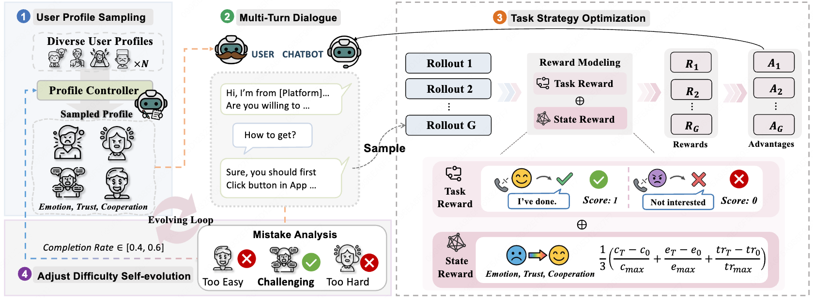
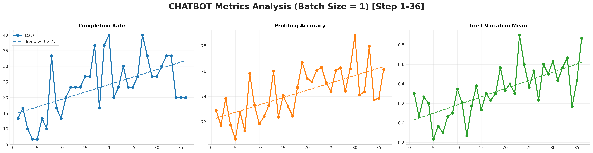

<h1 align="center">
 
  SEAD: Self-Evolving Agent for Service Dialogue
</h1>

<div align="center">

<p><em>A co-evolutionary reinforcement learning framework for training dialogue agents that adapt to diverse user scenarios without requiring additional training data.</em></p>

[](https://huggingface.co/dayll/SEAD-14B)
[](https://github.com/Da1yuqin/SEAD)
[](https://arxiv.org/abs/2602.03548)
</div>



**SEAD (Self-Evolving Agent for Service Dialogue)** - Co-evolutionary Training Loop Framework. The controller samples initial states (Phase 1), which initialize dialogues producing trajectories (Phase 2), used to train the agent with rewards (Phase 3) and compute completion rates (Phase 4), which feed back to adjust sampling distributions, closing the co-evolutionary loop.


✨If you like this project, please give it a star🌟—it's the best encouragement for us🥺!✨

---

## 🔥 News

**[2026-02-04]** — We've open-sourced our full research stack!  
- 📄 **Paper (arXiv)**: [arXiv:2602.03548](https://arxiv.org/abs/2602.03548)
- 💻 **Code (GitHub)**: Complete training, inference, and evaluation pipelines
- 🤗 **Model (Hugging Face)**: [dayll/SEAD-14B](https://huggingface.co/dayll/SEAD-14B)
- 📊 **Benchmark**: Benchmark and evaluation code is available

**What's included:**
- ✅ End-to-end training, inference, and evaluation pipelines
- ✅ Reproducible configs and scripts
- ✅ Pretrained checkpoints (14B parameters)
- ✅ Comprehensive evaluation suite
- ✅ Clear documentation and examples

---

## 📋 Table of Contents

- [✨ Highlights](#-highlights)
- [🤖 Model](#-model)
- [🏆 Performance](#-performance)
- [⬇️ Installation](#️-installation)
- [🚀 Quick Start](#-quick-start)
  - [Training](#training)
  - [Evaluation](#evaluation)
- [🙏 Acknowledgements](#-acknowledgements)
- [📖 Citation](#-citation)

---

## ✨ Highlights

🎯 **Zero Training Data Required**: Our co-evolutionary framework eliminates the need for manually collected dialogue data

🚀 **State-of-the-Art Performance**: Achieves 52.0% completion rate, outperforming GPT-4o (44.2%) with only 14B parameters

💰 **Cost-Effective**: Zero inference cost compared to commercial APIs (GPT-4o: ¥727.28 for 1000 samples)

🔄 **Self-Evolving**: Automatic curriculum learning through adaptive state sampling

⚡ **Efficient Training**: Supports distributed training on 8 GPUs with vLLM acceleration

---

## ⚙️ Features

### 🎓 Training & Optimization
- ✅ **Co-evolutionary Framework**: Adaptive curriculum learning via state controller
- ✅ **Distributed Training**: Multi-GPU support with efficient parallelization
- ✅ **Checkpoint Management**: Automatic saving and resuming


## 🤖 Model
SEAD is now available on huggingface-hub:
| Model Name | HF Checkpoint                                                | Size                                                    |
| ---------- | ------------------------------------------------------------ | :------: |
| SEAD-14b     | [🤗 dayll/SEAD-14B](https://huggingface.co/dayll/SEAD-14B) | **14B** 


## 🏆 Performance
## Experimental Results

### Main Results Comparison

| Method | Params | CR (%) | ATT ↓ | UPA | EI | TI | CI | Total Cost (CNY) |
|--------|--------|--------|-------|-----|----|----|----|--------------------|
| **Foundation Models** |
| Qwen2.5-14B-Instruct | 14B | 38.7 | 10.5±2.1 | 0.883±0.085 | 0.34±1.11 | 0.68±1.53 | 0.63±1.58 | 0.00 |
| Qwen2.5-32B-Instruct | 32B | 38.3 | 9.9±2.15 | 0.899±0.068 | -0.11±0.54 | 0.76±0.91 | 2.25±1.15 | 0.00 |
| Qwen2.5-72B-Instruct | 72B | 39.0 | **9.6±2.18** | 0.818±0.144 | <ins>0.51±1.32</ins> | 1.06±1.72 | 1.18±1.59 | 0.00 |
| **Large Model APIs** |
| GPT-4o | -- | <ins>44.2</ins> | 10.8±2.10 | 0.867±0.117 | 0.04±0.97 | 0.97±1.29 | 1.34±1.42 | 727.28 |
| DeepSeek-Chat | 671B | 31.6 | 11.3±2.10 | 0.863±0.084 | -0.20±0.97 | 0.27±1.24 | 0.76±1.50 | 87.36 |
| Qwen3-235B | 235B | 32.3 | 10.4±2.50 | 0.765±0.170 | -0.24±0.83 | 0.80±1.14 | 1.54±1.50 | 69.36 |
| LongCat-Flash | 560B | 42.2 | 10.0±2.31 | **0.925±0.079** | 0.28±1.15 | <ins>1.33±1.57</ins> | **1.56±1.46** | 23.08 |
| **SEAD (Ours)** | **14B** | **52.0** | **9.6±2.09** | <ins>0.912±0.071</ins> | **0.63±1.12** | **1.57±1.51** | <ins>1.55±1.39</ins> | **0.00** |

**Metrics:**
- **Params**: Model parameters (B=billion, "--" indicates undisclosed or not applicable)
- **CR**: Completion Rate (%)
- **ATT**: Average Turns to Target (lower is better ↓)
- **UPA**: User Portrait Accuracy
- **EI**: Emotion Improvement
- **TI**: Trust Improvement
- **CI**: Cooperation Improvement
- **Total Cost**: Total inference cost for 1000 multi-turn samples (CNY)

**Note**: **Bold** indicates best results. <ins>Underlined</ins> indicates second-best results. Standard deviations are shown where available.

### Dynamic Training Results

With the advancement of training, the model's metrics steadily improve, highlighting the effectiveness of RL. The hard business metric, Task Completion, achieves a significant boost, showing that the model has learned better strategies through free exploration. The increase in User Profile Accuracy demonstrates that the model understands users better, while the steady rise in the Trust Variation Mean indicates that the model can more easily gain user trust through conversation.

## ⬇️ Installation
### Environment
```bash
conda create -n SEAD python=3.10
conda activate SEAD
# install torch [or you can skip this step and let vllm to install the correct version for you]
pip install torch==2.4.0 --index-url https://download.pytorch.org/whl/cu121
# install vllm
pip3 install vllm==0.6.3 # or you can install 0.5.4, 0.4.2 and 0.3.1

# verl
pip install -e .

# flash attention 2
pip3 install flash-attn --no-build-isolation
pip install wandb
```

Alternatively, you can configure the environment according to `requirements.txt`:
```bash
pip install -r requirements.txt
```


The User Role-play Model operates within an isolated environment.

```bash
conda create -n vllm python=3.10
pip install -r requirements_vllm.txt
```


## 🚀 Quick start
To modify prompts (such as user profiles and SOP), edit the files in: ``./verl/trainer/config/format_prompt/``. 

Common user behaviors can be modified by editing
``./assets/client_action.jsonl``. These behaviors are randomly sampled and incorporated into user prompts to ensure dialogue diversity."
### Training
Our model requires no additional training data. Simply load the base model to start training:

Run RL training on 8 gpus
```bash
conda activate SEAD
bash ./scripts/main.sh 
``` 
Training Configuration:

Edit ./scripts/main.sh to customize:
- Base model path

Edit ./scripts/train_chatbot.sh to customize:
- Batch size and learning rate
- Checkpoint save frequency

To visualize dynamic curves locally, run the following command:

```bash
python for_evaluation/metrics_vis.py
```

The generated plots will be saved in `./outputs/evaluation/report`.

### Evaluation
Test any local model or your custom-trained model:

```bash
# Create Evaluation Set
python utils/create_prompt_data.py \
    --train_samples 0 \
    --test_samples 1000 \
    --behavior_library ./assets/client_action.jsonl \
    --out_dir ./outputs/evaluation/test_set/ \
    --temp_dir ./outputs/evaluation/test_set/user_param/
# Run the evaluation following the instructions in the log
bash ./for_evaluation/vllm_test_suite.sh
``` 
Modify ./for_evaluation/vllm_test_suite.sh to set:
- Model checkpoint path


## 🙏 Acknowledge

The SEAD framework draws inspiration from pioneering projects such as [Search-R1](https://github.com/PeterGriffinJin/Search-R1), is built upon [veRL](https://github.com/volcengine/verl) and [RAGEN](https://github.com/ZihanWang314/RAGEN/tree/main). 
We would like to sincerely thank the teams behind these projects for their invaluable contributions to open-source research and development.

## 🏷️ Citation
```bash
@article{SEADv1,
  title={SEAD: Self-Evolving Agent for Multi-Turn Service Dialogue},
  author={Yuqin Dai, Ning Gao, Wei Zhang, Jie Wang, Zichen Luo, Jinpeng Wang, Yujie Wang, Ruiyuan Wu, Chaozheng Wang},
  journal={arXiv preprint arXiv:2602.03548},
  year={2026}
}
```
